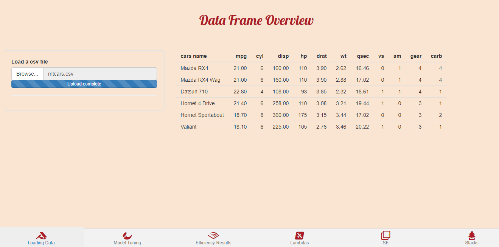

<!-- README.md is generated from README.Rmd. Please edit that file -->

```{r, include = FALSE}
knitr::opts_chunk$set(
  collapse = TRUE,
  comment = "#>",
  fig.path = "man/figures/README-",
  out.width = "100%"
)
```


# farrell <a></a>

<!-- badges: start -->


<a href="https://www.buymeacoffee.com/Fodil" target="_blank"></a>


<!-- badges: end -->

The goal of farrell is to provide an interactive interface to Data Envelopment Analysis modeling in R. The farrell package is built upon [Benchmarking](https://CRAN.R-project.org/package=Benchmarking).

## Installation

You can install the farrell package from CRAN with:


```{r, eval = FALSE}

install.packages("farrell")

```


## Example

You can run: 

```{r, eval=FALSE}
library(farrell)

farrell()

```

or if you're working on RStudio, just click on __Addins__ then __farrell__. 

## Data Loading: 


Hit __Browse...__ to upload your data frame in a csv format. All the inputs and outputs must be contained
within the uploaded data frame. Further, the data frame needs to contain an identification column in order
to identify Decision Making Units distinctively. It can be a numeric or a character column.


In the following examples, we use the mtcars data frame which has been exported in a csv format with an additional column: __cars name__. 





## Model Tuning


Within the Model Tuning tab, you will select the input and output variables, then you determine your identification column. Then you choose the Returns to Scale assumption between: crs, vrs, irs, drs, add and fdh. After that, you determine the orientation of the model, whether input or output. Finally, hit __Calculate Efficiency__ to get the results. 

Let's for example consider __mpg__ and __disp__ as the output variables and __wt__ as input. We choose __cars name__ as the identification column and model an input-oriented model with crs assumption. 


## Efficiency Results


The Efficiency Results tab displays the efficiency scores along with the peers for each unit in a descending order. You have the ability to download the result in a csv format. The tab also provides a summary of the distribution of the efficiency scores. 


## Lambdas


In the Lambdas tab, you get the contribution of the peers to the inefficient units' score. 


## Scale Efficiency 


The SE tab provides the Scale Efficiency score of each DMU under consideration. 


## Slacks

The Slacks tab displays a data frame containing the sum of the slacks and the slacks for each input/output variables. 


## Citation 

If you use the farrell package in your publications or teaching activities, please cite it as follows:


 Mohamed El Fodil Ihaddaden (2020). farrell: Interactive
  Interface to Data Envelopment Analysis Modeling. R
  package version 0.2.0.
  https://CRAN.R-project.org/package=farrell

A BibTeX entry for LaTeX users is

  @Manual{,
    title = {farrell: Interactive Interface to Data Envelopment Analysis Modeling},
    author = {Mohamed El Fodil Ihaddaden},
    year = {2020},
    note = {R package version 0.2.0},
    url = {https://CRAN.R-project.org/package=farrell},
  }


## Code of Conduct
  
Please note that the farrell project is released with a [Contributor Code of Conduct](https://contributor-covenant.org/version/2/0/CODE_OF_CONDUCT.html). By contributing to this project, you agree to abide by its terms.
