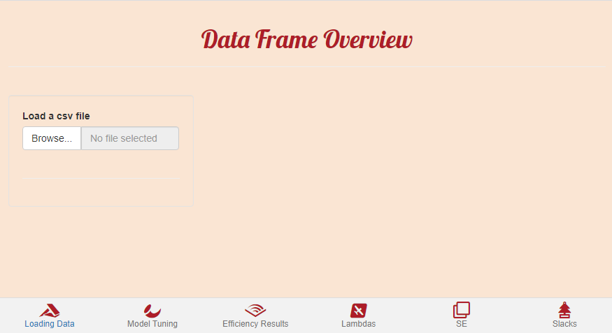
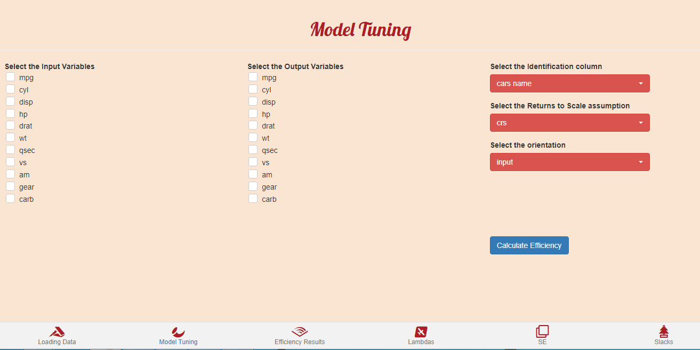
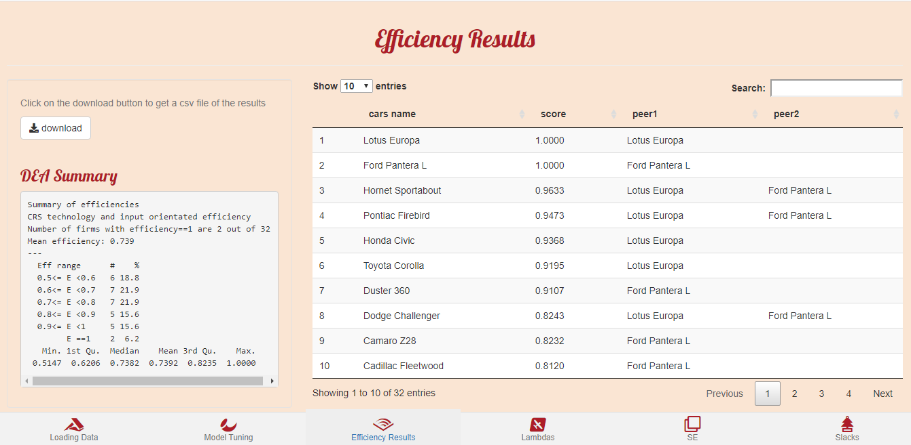
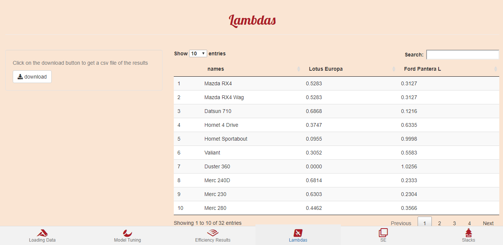
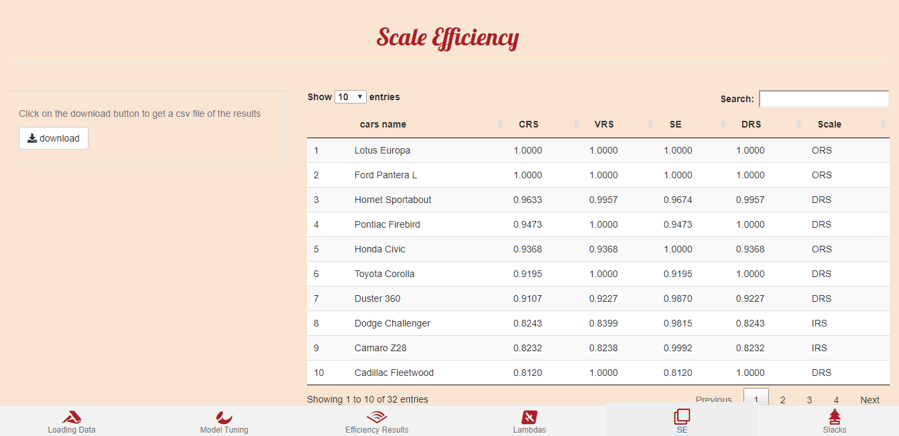

<!-- README.md is generated from README.Rmd. Please edit that file -->

# farrell <a></a>

<!-- badges: start -->

<!-- badges: end -->

The goal of farrell is to provide an interactive interface to Data
Envelopment Analysis modeling in R. The farrell package is built upon
[Benchmarking](https://CRAN.R-project.org/package=Benchmarking).

## Installation

You can install the development version of farrell with:

``` r
remotes::install_github("feddelegrand7/farrell")
```

## Example

You can run:

``` r
library(farrell)

farrell()
```

or if you’re working on RStudio, just click on **Addins** then
**farrell**.

## Data Loading:

Hit **Browse…** to upload your data frame in a csv format. All the
inputs and outputs must be contained within the uploaded data frame.
Further, the data frame needs to contain an identification column in
order to identify Decision Making Units distinctively. It can be a
numeric or a character column.



In the following examples, we use the mtcars data frame which has been
exported in a csv format with an additional column: **cars name**.


## Model Tuning



Within the Model Tuning tab, you will select the input and output
variables, then you determine your identification column. Then you
choose the Returns to Scale assumption between: crs, vrs, irs, drs, add
and fdh. After that, you determine the orientation of the model, whether
input or output. Finally, hit **Calculate Efficiency** to get the
results.

Let’s for example consider **mpg** and **disp** as the output variables
and **wt** as input. We choose **cars name** as the identification
column and model an input-oriented model with crs assumption.


## Efficiency Results

The Efficiency Results tab displays the efficiency scores along with the
peers for each unit in a descending order. You have the ability to
download the result in a csv format. The tab also provides a summary of
the distribution of the efficiency scores.



## Lambdas

In the Lambdas tab, you get the contribution of the peers to the
inefficient units’ score.



## Scale Efficiency

The SE tab provides the Scale Efficiency score of each DMU under
consideration.



## Slacks

The Slacks tab displays a data frame containing the sum of the slacks
and the slacks for each input/output variables.


## Citation

If you use the farrell package in your publications or teaching
activities, please cite it as follows:

Mohamed El Fodil Ihaddaden (2020). farrell: Interactive Interface to
Data Envelopment Analysis Modeling. R package version 0.1.0.
<https://github.com/feddelegrand7/farrell>

A BibTeX entry for LaTeX users is

@Manual{, title = {farrell: Interactive Interface to Data Envelopment
Analysis Modeling}, author = {Mohamed El Fodil Ihaddaden}, note = {R
package version 0.1.0}, url =
{<https://github.com/feddelegrand7/farrell>}, }

## Code of Conduct

Please note that the farrell project is released with a [Contributor
Code of
Conduct](https://contributor-covenant.org/version/2/0/CODE_OF_CONDUCT.html).
By contributing to this project, you agree to abide by its terms.
