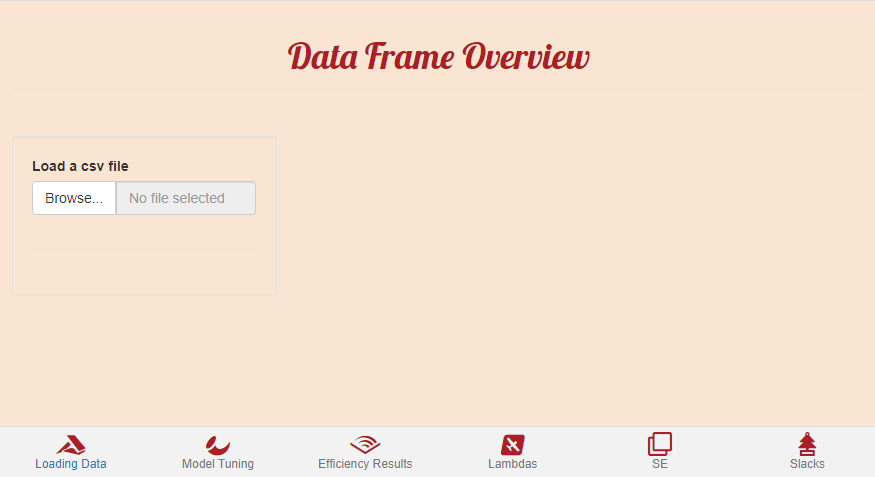
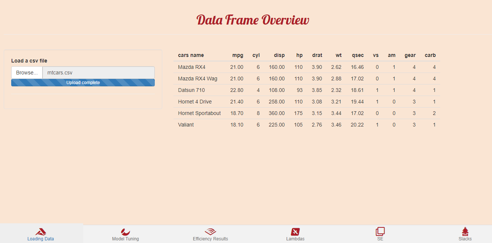
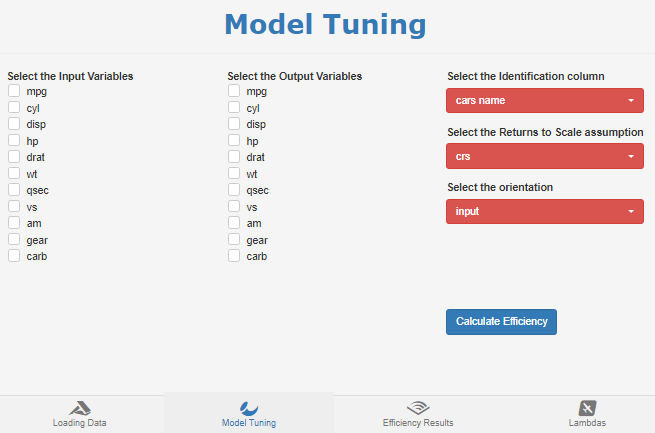
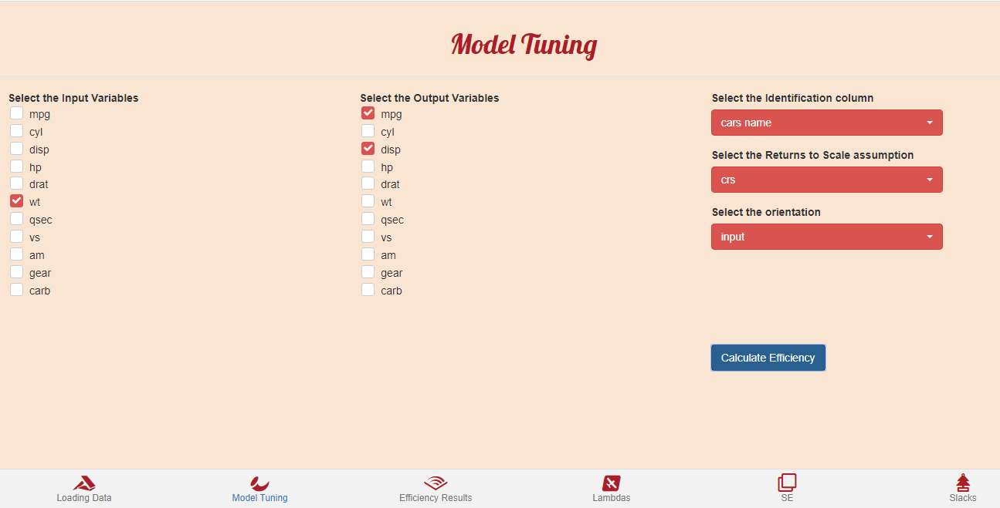
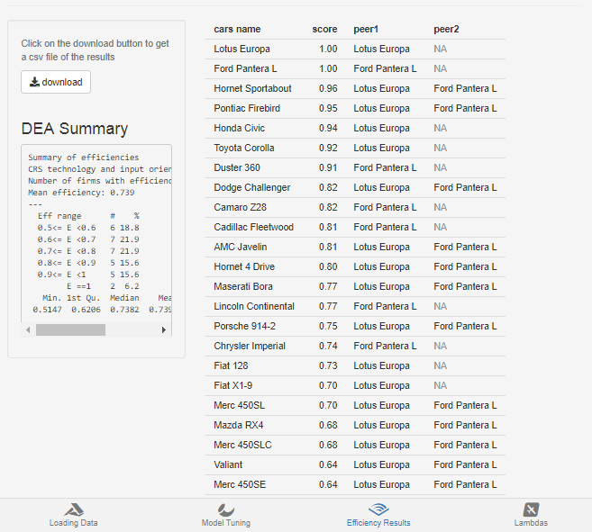
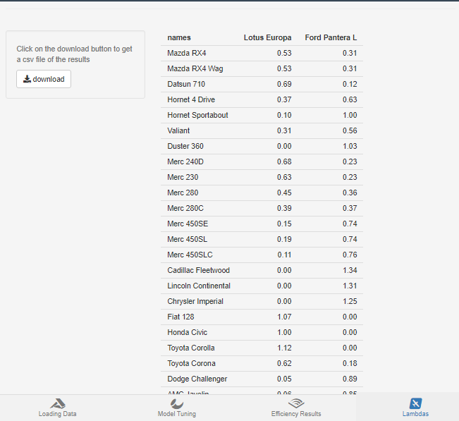
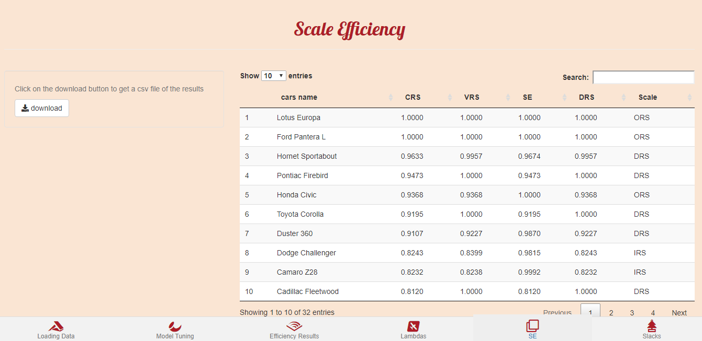
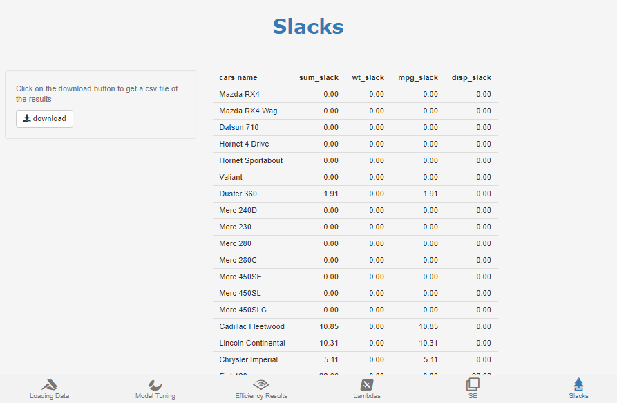

```{r, include = FALSE}
knitr::opts_chunk$set(
  collapse = TRUE,
  comment = "#>"
)
```


The goal of farrell is to provide an interactive interface to Data Envelopment Analysis modeling in R. The farrell package is built upon [Benchmarking](https://CRAN.R-project.org/package=Benchmarking).

## Installation

You can install the development version of farrell  with:

```{r, eval = FALSE}
remotes::install_github("feddelegrand7/farrell")
```


## Example

You can run: 

```{r, eval=FALSE}
library(farrell)

farrell()

```

or if you're working on RStudio, just click on __Addins__ then __farrell__. 


## Data Loading: 


Hit __Browse...__ to upload your data frame in a csv format. All the inputs and outputs must be contained within the data frame (each column for each input/output). Further, the data frame needs to contain an identification column in order to identify Decision Making Units. It can be a numeric or a character column. 




In the following examples, we use the mtcars data frame which has been exported in a csv format with an additional column: __cars name__. 





## Model Tuning




Within the Model Tuning tab, you will select the input and output variables, then you determine your identification column. Then you choose the Returns to Scale assumption between: crs, vrs, irs, drs, add and fdh. After that, you determine the orientation of the model, whether input or output. Finally, hit __Calculate Efficiency__ to get the results. 

Let's for example consider __mpg__ and __disp__ as the output variables and __wt__ as input. We choose __cars name__ as the identification column and model an input-oriented model with crs assumption. 




## Efficiency Results


The Efficiency Results tab displays the efficiency scores along with the peers for each unit in a descending order. You have the ability to download the result in a csv format. The tab also provides a summary of the distribution of the efficiency scores. 





## Lambdas


In the Lambdas tab, you get the contribution of the peers to the inefficient units' score. 




## Scale Efficiency 


The SE tab provides the Scale Efficiency score of each DMU under consideration. 



## Slacks

The Slacks tab displays a data frame containing the sum of the slacks and the slacks for each input/output variables.




